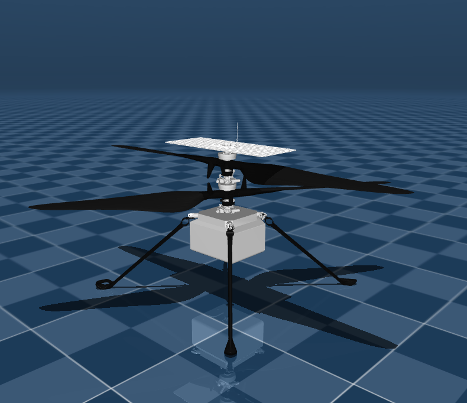

# Ingenuity MuJoCo

<p align="center">
  
</p>

Ingenuity MuJoCo is a MuJoCo model that is based on the[NasaJPL URDF](https://github.com/nasa-jpl/m2020-urdf-models) for simulating flight operations.

- [Features](#features)
- [Getting Started](getting-started)
  - [Prerequisites](#prerequisites)
  - [Installation](#installation)
- [Contributing Model Quality](#contributing-model-quality)
- [Acknowledgments](#acknowledgments)
- [Citing Ingenuity-Mujoco](#citing-ingenuity-mujoco)
- [License](#license)

## Features
Here are some of the model's features:

- IMU sensor
- Laser rangefinder sensor
- 1 navigation camera
- 2 actuators for each blade and 2 more for XY movement

## Getting Started

### Prerequisites
This model was created using MuJoCo version 3.1.3. You can download prebuilt binaries from the GitHub [releases page](https://github.com/google-deepmind/mujoco/releases/). If you wish to work with Python, you can install the native bindings from PyPI using the command pip install mujoco.

### Installation
To use the model, simply clone the repository into the directory of your choice.

```
git clone https://github.com/alefram/ingenuity-mujoco.git
```

I recommend using the [simulate](https://github.com/google-deepmind/mujoco/tree/main/simulate) tool within the MuJoCo package to explore the model and observe its capabilities by launching it.

```
./simulate <project-path>/scene.xml
```

If you wish to use the model in a C/C++ script, you can do so using the `mj_loadXML` function.

```c++
#include <mujoco.h>

mjModel* model = mj_loadXML("ingenuity-mujoco/mhs.xml", nullptr, nullptr, 0);
mjData* data = mj_makeData(model);
mj_step(model, data);
```

or via Python:

```python
import mujoco

model = mujoco.MjModel.from_xml_path("ingenuity-mujoco/mhs.xml")
data = mujoco.MjData(model)
mujoco.mj_step(model, data)
```

## Contributing Model Quality

The goal of this project is to faithfully replicate the real Ingenuity system and continually improve it. While the current model may not be optimal, I welcome contributions from others to enhance its quality. Additionally, also create examples, such as controllers and AI agents, to test the model. If you have any ideas or suggestions, please open an issue and share them with me.

## Citing Ingenuity-MuJoCo

If you use Ingenuity-mujoco in your work, I would glad to use the following citation.

```bibtex
@software(ingenuitymujoco2024github,
  author = {Fraudita, Alexis and {Ingenuity MuJoCo Contributors}},
  title = {{Ingenuity MuJoCo: a MuJoCo model based on the NasaJPL Urdf for simulate flight operations}},
  url = {https://github.com/alefram/ingenuity-mujoco},
  year = {2024},
}
```

## Acknowledgments

The assets in this repository are created by the talented engineers from the NASA JPL team and designers who created the original URDF version. This project would not have been possible without their open-source contributions. They have inspired me to learn and develop this version. Thank you.

## License

This project is licensed under the MIT License
